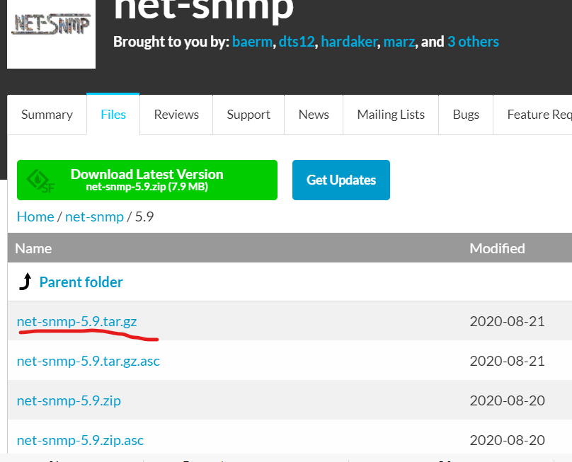
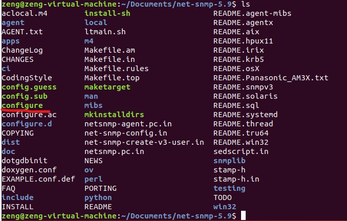
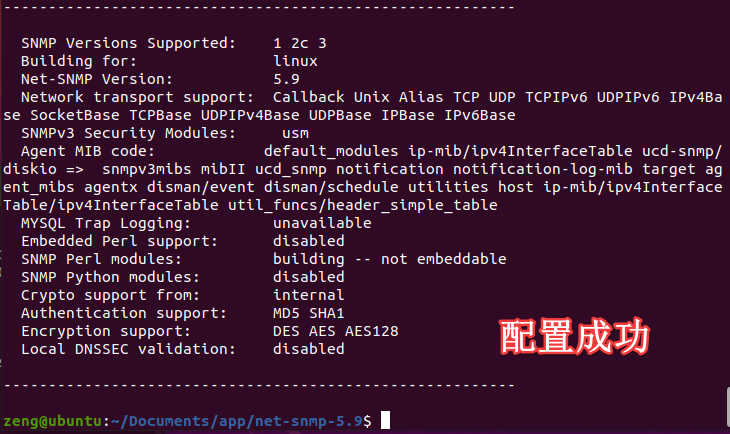
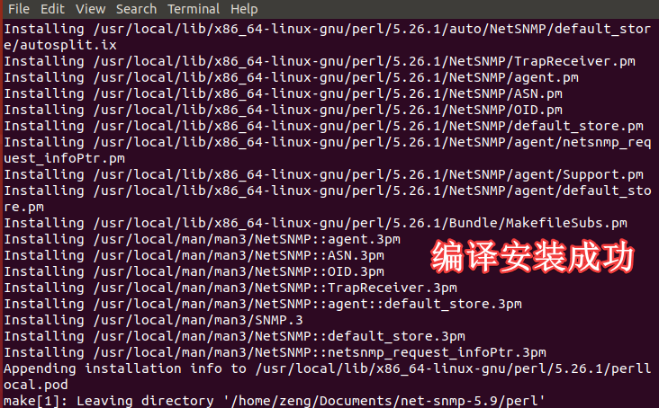
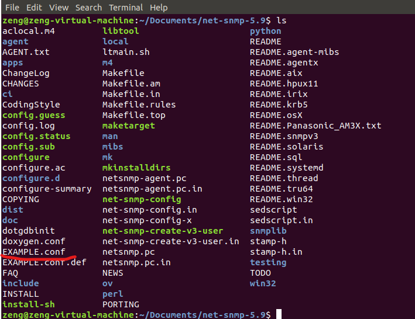
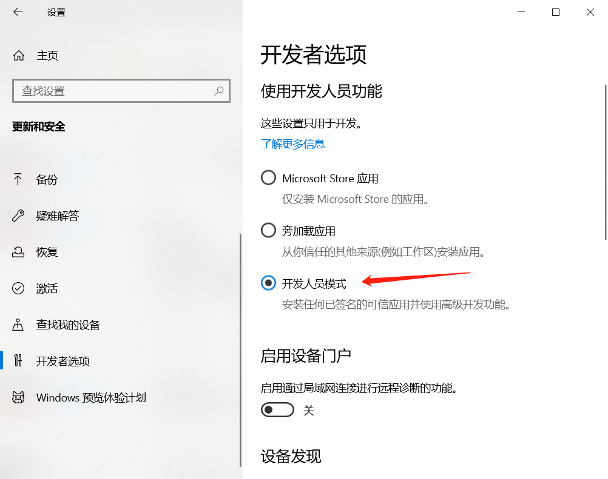
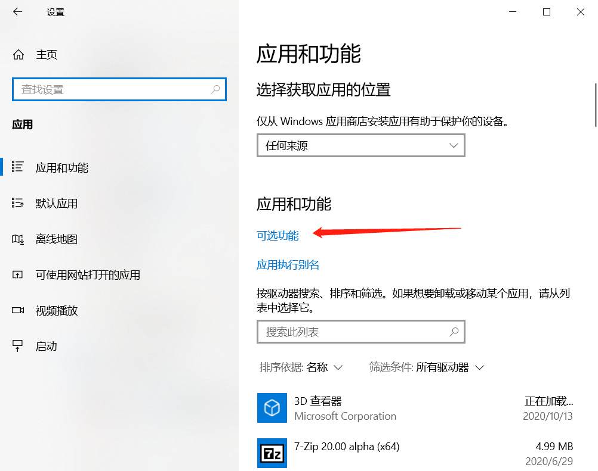
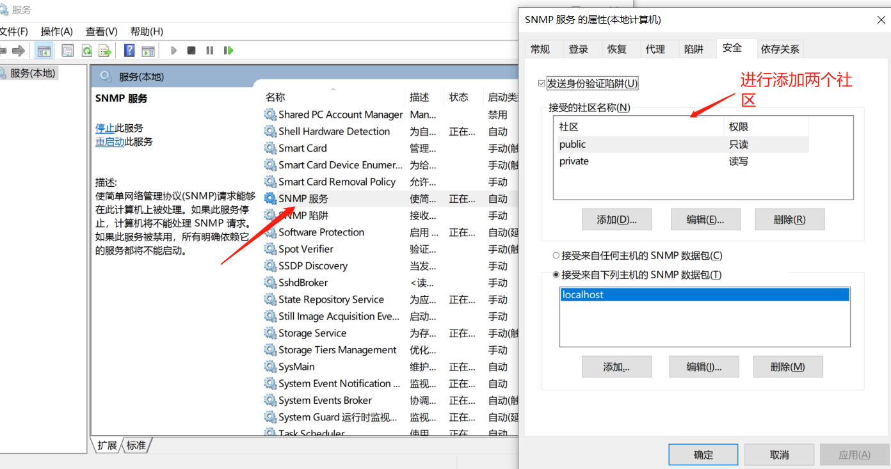

# Ubuntu 18.04搭建Net-SNMP

## 安装SNMP

### 下载Net-SNMP源代码

选择一个SNMP版本,这里用的是5.9版,下载地址:https://sourceforge.net/projects/net-snmp/files/net-snmp/5.9/



下载linux版本.

### 对源代码包进行解压缩

使用`tar -zxvf net-snmp-5.9.tar.gz`解压文件.

### 通过configure来生成编译规则

进入<strong style="color:red;">net-snmp-5.9</strong>目录下,运行<strong style="color:green;">configure</strong>



执行命令`./configure --prefix=/usr/local/snmp --with-mib-modules='ucd-snmp/diskio ip-mib/ipv4InterfaceTable'`后<strong style="color:rgb(0, 191, 166);">全部回车默认</strong>.



如果<strong style="color:red;">失败</strong>可能是未安装编译套件,使用`sudo apt install build-essential`.

### 编译和安装

执行`sudo make && sudo make install`命令进行编译安装.

如果编译<strong style="color:red;">失败</strong>可以尝试安装依赖包解决`sudo apt-get install libperl-dev`.



编译安装成功.

### 配置snmpd.conf

使用`ls`命令查看<strong style="color:green;">/usr/local/snmp</strong>目录下是否存在<strong style="color:green;">etc</strong>目录，如果不存在<strong style="color:green;">etc</strong>目录，就创建一个:


使用`sudo mkdir etc`命令创建etc目录:


找到SNMP源码目录(net-snmp-5.9)下EXAMPLE.conf文件,如下图所示:



使用命令`sudo cp EXAMPLE.conf /usr/local/snmp/etc/snmpd.conf`复制该文件到<strong style="color:green;">/usr/local/snmp/etc/</strong>下并重命名为<strong style="color:#e67c86;">snmpd.conf</strong>.

#### 配置允许网络访问

找到[**<strong style="color:orange;">AGENT BEHAVIOUR</strong>**],如下图所示:


修改如下:


#### 选择v2c SNMP协议的版本

找到[<strong style="color:orange;">**ACTIVE MONITORING**</strong>],如下图所示:


修改如下:


#### 设置访问权限

找到[<strong style="color:orange;">ACCESS CONTROL</strong>],如下图所示:


找到[**<strong style="color:orange;">rocommunity public default -V systemonly</strong>**],把 <strong style="color:orange;">-V systemonly</strong>去掉，这是设置访问权限的,去掉后能访问全部,如下图所示:


保存退出!

### 启动snmp服务

`/usr/local/snmp/sbin/snmpd -c /usr/local/snmp/etc/snmpd.conf`.

## 测试SNMP

获取本机的系统名字,使用命令:`snmpget -v 2c -c public localhost sysName.0`或者`snmpget -v 2c -c public 本机的ip地址 sysName.0`或者`snmpget -v 2c -c public 本机的ip地址 .1.3.6.1.2.1.1.5.0`进行测试.

执行以下的几个命令都可以获取到本机的系统名字:

```bash
snmpget -v 2c -c public localhost sysName.0
snmpget -v 2c -c public 127.0.0.1 sysName.0
snmpget -v 2c -c public 192.168.1.229 sysName.0
snmpget -v 2c -c public localhost .1.3.6.1.2.1.1.5.0
snmpget -v 2c -c public 127.0.0.1 .1.3.6.1.2.1.1.5.0
snmpget -v 2c -c public 192.168.1.229 .1.3.6.1.2.1.1.5.0
```

如下图所示:


## 开启161端口的访问权限

完成snmpd的配置并且SNMP测试通过之后要确保Linux的iptables防火墙对外开放了<strong style="color:#126bae;">udp 161端口</strong>的访问权限,可以使用`sudo iptables -L -n`查看当前iptables规则,如下图所示:


可以看到，目前iptables防火墙并没有对外开放udp 161端口的访问权限,也就是说,此时外面的计算机是无法访问Linux下的SNMP服务的,可以使用`sudo ufw allow 161`命令<strong style="color:#126bae;">打开161端口</strong>如下图所示:


# Win10开启SNMP服务

## 开启开发者选项



## 在应用中安装SNMP



如果没有则选择添加


## 开启SNMP服务

